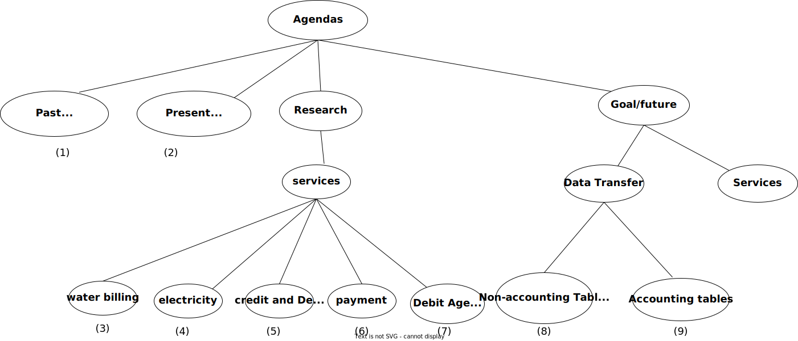

# RENTIZE
**Objectives**

- The rentize system has two main users, the **landlord** and the **tenant**. It allows for management of
    mutall enterprise.

    | User     | Long-term Objectives                                                                                                                                                                                           |
    | -------- | -------------------------------------------------------------------------------------------------------------------------------------------------------------------------------------------------------------- |
    | tenant   | 1. They should be able to view the monthly invoices (payments), and the reports `should be accurate`. 2. The client must be able to interrogate the system and view the historical statement of their account. |
    | landlord | 1. KRA Tax Compliance. Using the accounting program, the landlord's tax complaince to KRA should become easier                                                                                                 |

- Upgrade mutall_rental to rentize,i.e., have the accounting bit in mutall_rental separated to
  - rentize.
  - accounting module.
- `Other Objectives`.  
    - Change the database according to the specifications.
     - [ ] Remove the accounting table. ` It is part of the Accounting model`,
     - [ ] Change the `client` entity/table to `tenant`.

- The migration module helps in the visualization of the movement of applications and databases from `Mutall.co.ke` to `Digital Ocean`.
  During the migration, the system is set to change its operability style but retain its operability functions.
  The migration module will help do that, and it is visualized below.
  .

## Agenda

### Past/Timeliness(1)

1.[ ] May Invoices for clients to be produced by the second of the month.i.e., May2.`JK`

### Present/Differences(2)

1. [ ] Try and produce reports on both BUIS and OUTLOOK and check the differences
in the two reports .`Camillus and James`
    - [ ] List the problems encountered when producing the reports and report on
        the issues in the next session.`Camillus and James`.
2. [ ] Make sure invoicing runs in outlook.`James`.

###Research

#### WATER Billing Service(3)
1. [ ] Deploy the water billing template.`FN`.

#### ELECTRICITY Billing Service(4)
1. [ ] Develop/deploy the Electricity billing(KPLC) template.`Maggy/JK`.

#### Credit and Debit(5)
1. [ ] Develop/deploy the Adjustments Credit and Debit template.`Carol/Peter`.

#### Payment services(6)
1. [ ] Develop/deploy the Payment template.`Maggy/FN`.
    
#### Debt Analysis(7)
1. [ ] Demonstrate the final desired output  by next meeting.`PK`.

###Goal/Future

#### Data transfer

##### Non-accounting tables(8)

1. [ ] Reload the tenant data using the new model and new questionnaire.`PM and FN`.
2. [ ] Load the agreement data.`FN and JK`.

##### Accounting tables(9)

#### Services
