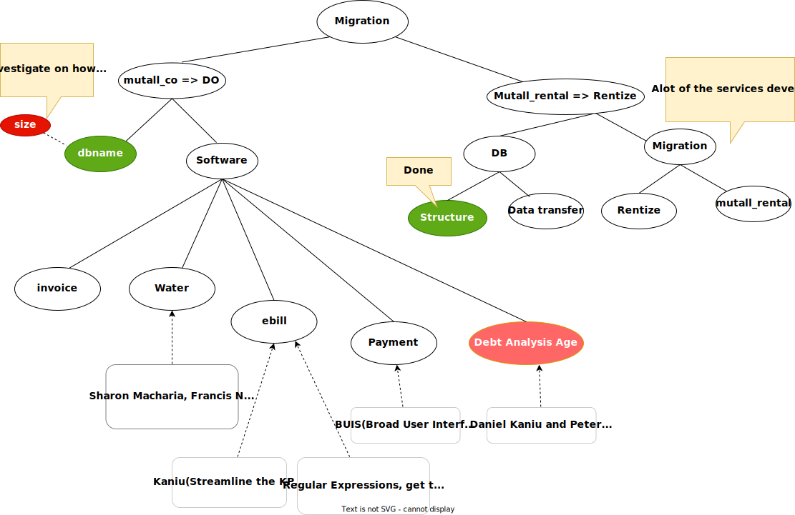

# RENTIZE
## Objectives

- The rentize system has two main users, the **landlord** and the **tenant**. It allows for management of
    mutall enterprise.

    | User     | Long-term Objectives                                                                                                                                                                                           |
    | -------- | -------------------------------------------------------------------------------------------------------------------------------------------------------------------------------------------------------------- |
    | tenant   | 1. They should be able to view the monthly invoices (payments), and the reports `should be accurate`. 2. The client must be able to interrogate the system and view the historical statement of their account. |
    | landlord | 1. KRA Tax Compliance. Using the accounting program, the landlord's tax complaince to KRA should become easier                                                                                                 |

- Upgrade mutall_rental to rentize,i.e., have the accounting bit in mutall_rental separated to
  - rentize.
  - accounting module.
- `Other Objectives`.  
    - Change the database according to the specifications.
     - [ ] Remove the accounting table. ` It is part of the Accounting model`,
     - [ ] Change the `client` entity/table to `tenant`.
# Agenda
- The migration module helps in the visualization of the movement of applications and databases from `Mutall.co.ke` to `Digital Ocean`.
  During the migration, the system is set to change its operability style but retain its operability functions.
  The migration module will help do that, and it is visualized below.
  .

## Monthly INVOICING service
** 16/03/2022 **
1.  [x] `Errors`. Have a look at the errors generated from the movement of the 
                water bill system to **digital_ocean**.
        `Mr.Muraya`.
    - [x] Have a local version of the mutall_co database and resolve the 
              issues locally, and once they are done, fix the 
                same issues online.`Nyakundi`

2. [x] `Report Familiarity`.To make your work easier,familiarize yourself with the reports. 
    
` Camilus and James`.

3. [x] `Training`.Train `Joel` on how to use the mutall rental system for reporting
            and he should report on the reporting requirements that he needs, 
            so that we can develop such a reporting mechanism.`Camillus` or anyone.
**6/04/2022**
1. [ ] Try and produce reports on both BUIS and OUTLOOK and check the differences
in the two reports .`Camillus and James`
    - [ ] List the problems encountered when producing the reports and report on
        the issues in the next session.`Camillus and James`.
2. [ ] Make sure invoicing runs in outlook.`James`.

## WATER Billing Service
**16/03/2022**
1. [ ] Fix the Water readings and ebill on digital ocean.
2. [ ] Look at the water reading modules on mutall.co.ke. `Nyakundi`.
3. [ ] `Data Collection`. Collect the Water bill data physically and make sure it is sent to the server.
        `Sharon,Nyakundi,James`.

## ELECTRICITY Billing Service
**16/03/2022**
1.  [ ] Fix the ebill references once the modules are on Digital Ocean `Kaniu`.

3.  [ ] Get the previous message format and check against the new format to 
        modify the regular expressions to facilitate resending of KPLC bills to 
        the clients.`Peter`.
4.  [ ] Refine the regular expression to obtain the information of interest.`Peter`.

**23/03/2022**
1. [ ] Lead the installation of Android and INTELLIJ IDE.`Kaniu`.
2. [x] Demonstrate  on how to get messages from KPLC 9771. `Kaniu`.
3. [ ] Develop a refined regular expressions scheme for extracting messages
         in their correct format.`Peter`.

**30/03/2022**
1. [ ] Demonstrate on how to retrieve messages from the messages inbox.`Kaniu`.
2. [ ] Investigate on how texts are processed into a JSON format,specifically
        how the line markers are converted.`Peter and Mr.Muraya`.
**6/04/2022**
```
    Ebill to be given a pause as we learn Android development. (Deferred to later).
```
## PAYMENT Services
**16/03/2022**
1. [x] Design an interface for capturing the credit and debit from the clients. `Camillus`.
2. [x] Modify the current payment template to include details from mutall rental.`James`

## Data Transfer from mutall_rental to Rentize

**16/03/2022**
1. [x] Demonstrate on how to perform a backup using linux.

**30/03/2022**
1. [ ] `Backup`. Create an automated backup system that include a local backup for all
                databases and the files. **Backups should go for a year with the name of the file, day, month, and year**. 
         `Peter`
         - [ ] Connect to the mutall_co database and perform the server backups. `Peter`
         - [ ] Connect to Digital Ocean database and perform a server backup. `Peter`
         - [ ] Using the local server connect to the digital ocean server and perform
        backup. `Peter`

## Development of a new rental system Rentize
**16/03/2022**
1. [x] Have `mutall_rental` and `rentize` setup and running in your local machine.
        `James`.
2. [x] Get Mr. Muraya's code and try running mutall_co rental on his local machine.
       `James`
**30/03/2022/**
1. [x] Get a copy of the new schema and outlook and ensure that it runs your 
    applications. `James`.
2. [ ] Modify his rentize model to remove the duplicate fields.`James`.

## Class Diagrams
**16/03/2022**
1. [ ] Come up with the mutall_co rental class diagram.`James`.
2. [ ] Draw the metavisuo class diagram.`Sharon`.

## Accounting Module
**16/03/2022**  
1. [ ] Presentation on how to capture transactions within a ledger. `Camillus`.

2. [ ] Model Accounting charts in `tracker` and `rentize` to show us which account to debit and which accounts to credit.
    - Refer to the dealer model for further information.`Camillus`.
**30/03/2022**
1. [ ] Create an accounting report for a single client to help us visualize what
    we exactly need to push this further.`Camillus`
**6/04/2022**
## Debt Age Analysis
    
**16/03/2022**
1. [ ] Have the current mutall_co database on access, and use it to perform debt
       age analysis.`Peter,Kaniu, and Camillus`.

**23/03/2022**
1. [ ] Redo the process and show a demonstration of the Debt_age analysis.`Peter`.

## Data Migration
**16/03/2022**
1 . [ ] `Restructuring code`. After the reference to the server are resolved, restructure the code to have rentize as part of the library
        under, `rentize/v/code`.`guided by Mr.Muraya` using the `MIGRATION MODULE`
2.  [x] Transfer of data between databases and transfer of databases.`Mr.Muraya`.
        - Began a demonstration on the presentation of how to migrate data from
           one database to another using the capture/query and with a json.`Mr.Muraya`.
    **30/03/2022**
1. [ ] Continue with the presentation and demonstrate on how to move data from
        the mutall_co database to the mutall_rental.
    `ACCOUNTING MODULE`
     - This module will enable the management of financial records.
        - [ ] Refresh on the basics of Accounting.
**6/04/2022**
1. [ ] Try to migrate data from mutall_rental to rentize.`Francis and Peter`.
2. [ ] Read on CTE(Common Table Expressions), Left joins and learn on how to use
    them for matching data.
# Completed Assignments
- [x] `Database Migration`.load mutall_rental from the server `mutall.co.ke` to digitial ocean `206.189.207.206`.
`James and Peter`.
- [x] `Database`. Rearrange the mutall_rental system to have a view similar to the mutall_rentize to view the similar
  entities and associate them.
- [x] .`Code`. Migrate the code to the mutall_rental code to `digital_ocean` and resolve the references to the server.
`Nyakundi`.
- [x] Learn how to do a markup with a Table of Contents `Sharon`.
- [x] Pursue KRA reporting (Accounting Module).`Camillus`.
- [x] `Database Migration` . Conceive and integrate a migration module into the
        time table.
        `Mr.Muraya`.
- [x] Demonstrate on how BUIS is used to send messages.`Camillus`.
- [x] Show Kaniu how the KPLC bills are collected and Sent.`Camillus`.
- [x] Train `James` on how to use the mutall_rental system.`Camillus`.
- [x] You should be able to see an error and know where to go.
- [x] You should be able to generate the reports and supply them to the tenants.
- [x] `Documentation`.Think of a system for accessing markdown files. Say for example, on the server, have a folder under the application
        such as `http://206.189.207.206/tracker/mdview.js` from there, you can call the file from any application, i.e.,
        `mdview.js?filename=kentionary/doc/fs.md`. 
        `Peter`.